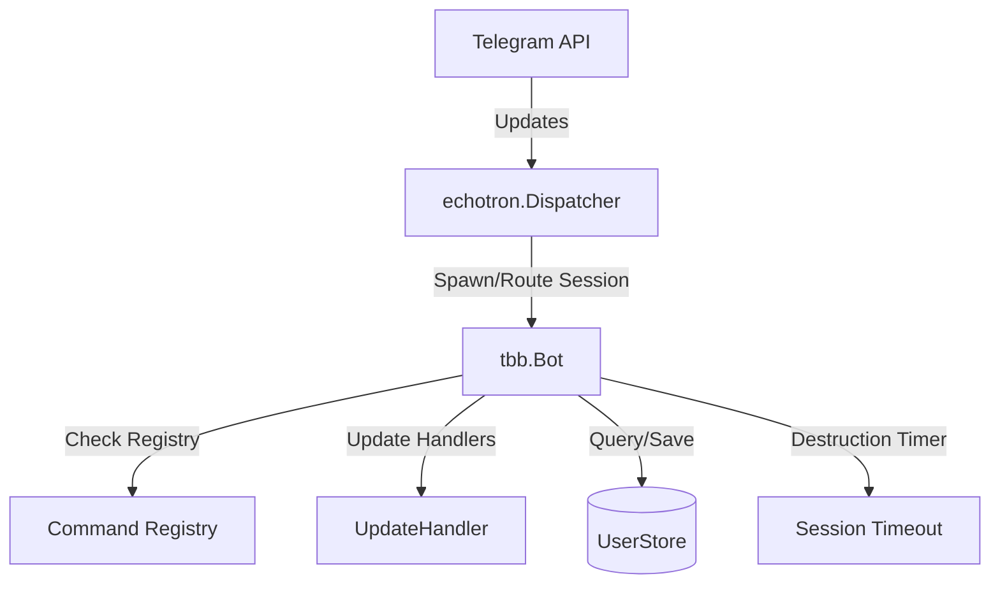
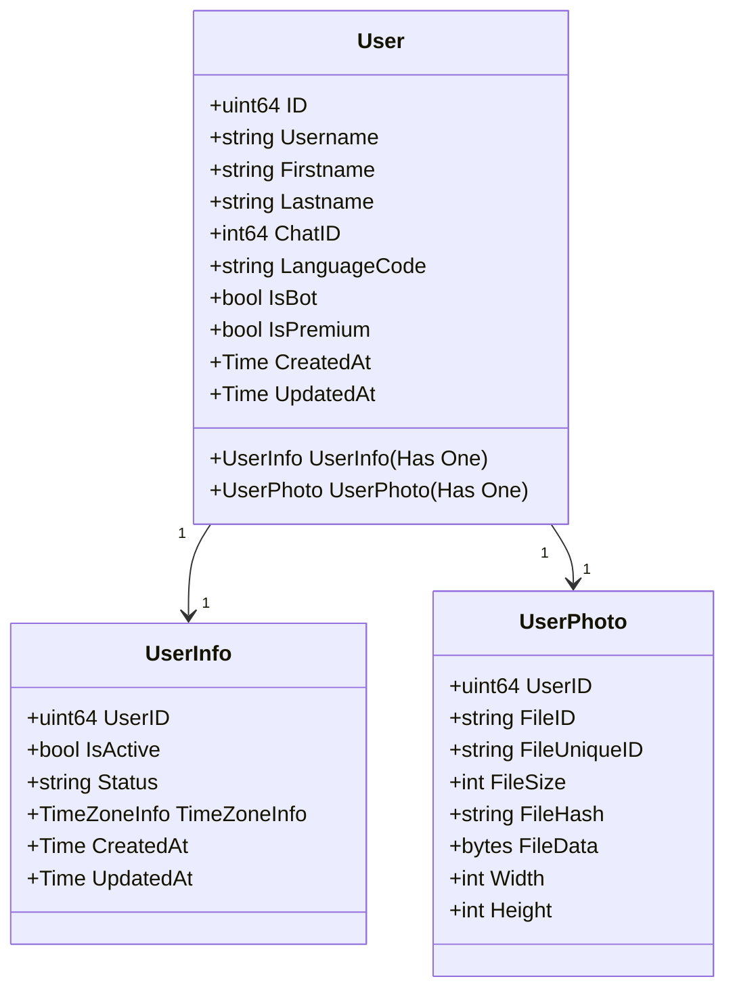
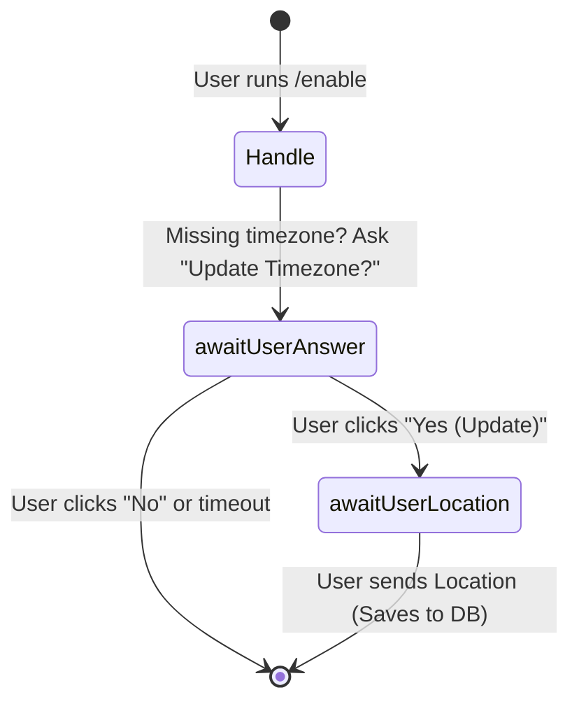

# Developer Agent Guide: TBot (tbb)

Welcome, Agent! This guide describes the architecture, design patterns, database models, and extendability of the **TBot (`tbb`)** Go-based Telegram bot framework. Use this file as your primary context when adding features, debugging, or refactoring the repository.

---

## 🏗️ Architecture Overview

`tbb` is built on top of the concurrent Telegram Bot library [NicoNex/echotron](https://github.com/NicoNex/echotron) and provides a database-agnostic storage layer.



### Core Components

1. **`TBot` (in [tbb.go](file:///Users/skn/Development/GitHub/tbb/tbb.go))**: The central orchestrator that sets up the user store, logger, global commands, timezone cache, and HTTP webhook/polling server.
2. **`Bot` (in [bot.go](file:///Users/skn/Development/GitHub/tbb/bot.go))**: Represents an active user session/chat ID. The `echotron.Dispatcher` creates one `Bot` instance per unique `chatID`.
   - **Session Lifespan**: Governed by `BotSessionTimeout` (in minutes). After this period of inactivity, the session self-destructs (`b.destruct()`) to conserve memory.
   - **User Cache**: Holds the `User` entity, updating fields like profile photo and usernames dynamically every 24 hours (or when specified by `updateDuration`).
3. **`UserStore` (in [store.go](file:///Users/skn/Development/GitHub/tbb/store.go))**: A storage interface for managing bot users. Defaults to a thread-safe `InMemoryStore`. Developers can plug in their own store implementation (e.g. GORM, MongoDB, or raw SQL) via `WithUserStore(...)`.
4. **`UpdateHandler` (in [handler.go](file:///Users/skn/Development/GitHub/tbb/handler.go))**: Defines hooks for various Telegram updates (`HandleMessage`, `HandleCallbackQuery`, etc.). Can be overridden globally via functional options.
5. **`CommandHandler`**: A specialized interface for handling commands (e.g., `/enable`).

---

## 🗄️ Storage Models

The model schemas defined in `model.go` represent standard Go structures representing a user and their attributes:



### Implementing Custom Storage
To persist users to a database, implement the `UserStore` interface:

```go
type UserStore interface {
    FindUserByChatID(chatID int64) (*User, error)
    Save(user *User) error
}
```
And register it with `tbb.New(tbb.WithUserStore(myCustomStore))`.

---

## 🔄 State Machine & Conversations

`tbb` uses a functional state machine pattern to handle multi-step interactions.

1. **State Signature**: `type StateFn func(*echotron.Update) StateFn`
2. **Execution Flow**:
   - When a command is triggered, its `Handle()` method is executed and returns a `StateFn`.
   - If `StateFn` is non-nil, the session's active state transitions to that function.
   - Subsequent user updates are routed directly to this active `StateFn`.
   - Return `nil` to reset the state machine and return to the default update handler.

### Conversational State Diagram Example (`/enable` command)



---

## ⚙️ Configuration File & Composition

Configuration is defined via YAML. Example config (`example.config.yml`):

```yaml
debug: true
logLevel: info # One of debug | info | warn | error
telegram:
  botToken: "YOUR_TELEGRAM_BOT_TOKEN"
botSessionTimeout: 5 # Session memory retention in minutes
allowedChatIDs: [] # (Optional) Restrict access to specific Chat IDs
```

### Custom Settings Extension (Composition Pattern)
Since `tbb` is designed to be extensible, you can extend the configuration by embedding `tbb.Config` directly into your custom configuration struct:

```go
type CustomConfig struct {
	tbb.Config `yaml:",inline"`
	MyDatabaseURL string `yaml:"database_url"`
	CustomFeature bool   `yaml:"custom_feature"`
}

// Then parse it directly with standard yaml library:
data, err := os.ReadFile("config.yml")
var myCfg CustomConfig
err = yaml.Unmarshal(data, &myCfg)
```

Pass the embedded config to `tbb.New` via `tbb.WithConfig(&myCfg.Config)`.

### Direct Functional Configuration Options
Instead of loading from a YAML file, you can configure `tbb` programmatically via functional options:

```go
tbot := tbb.New(
	tbb.WithToken("my_telegram_token"),
	tbb.WithAllowedChatIDs([]int64{12345678}),
	tbb.WithSessionTimeout(15),
	tbb.WithUserStore(myStore),
)
```

---

## 🛠️ Step-by-Step: Adding a New Command

Follow this pattern to add a command (e.g. `/status`):

### 1. Create the Command Handler
Create a file under `pkg/command/status.go`:

```go
package command

import (
	"fmt"
	"github.com/NicoNex/echotron/v3"
	"github.com/apperia-de/tbb"
)

type Status struct {
	tbb.DefaultCommandHandler
}

func (c *Status) Handle() tbb.StateFn {
	user := c.Bot().User()
	msg := fmt.Sprintf("Hello %s, your notifications are currently %t.", user.Firstname, user.UserInfo.IsActive)
	_, _ = c.Bot().API().SendMessage(msg, c.Bot().ChatID(), nil)
	return nil // No further state steps needed
}
```

### 2. Register the Command
In your `main.go`, add the command definition to the `tbb.New(...)` setup:

```go
app := tbb.New(
	tbb.WithConfig(cfg),
	tbb.WithCommands([]tbb.Command{
		{
			Name:        "/status",
			Description: "Show your current subscription status",
			Handler:     &command.Status{},
		},
		// other commands...
	}),
)
```

---

## 🧪 Testing & Local Run

1. Run unit tests to verify database migrations, timezones, and config loading:
   ```bash
   go test ./...
   ```
2. For testing/running the server locally:
   - Duplicate `example.config.yml` as `config.yml`.
   - Replace `telegram.botToken` with your test bot token from [@BotFather](https://telegram.me/botfather).
   - Start the main app:
     ```bash
     go run cmd/example/main.go
     ```
